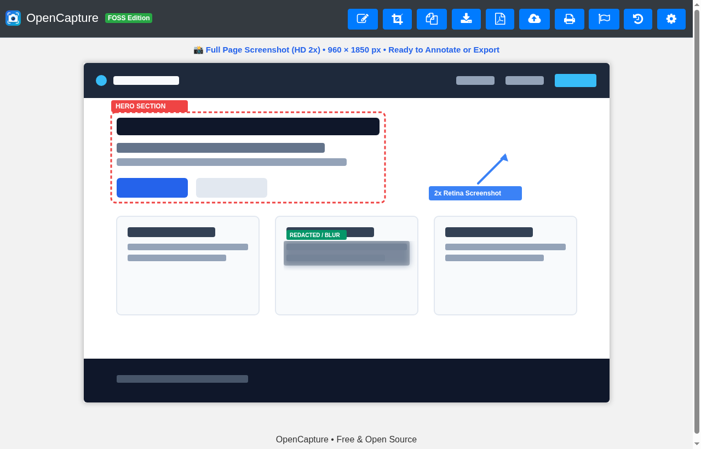
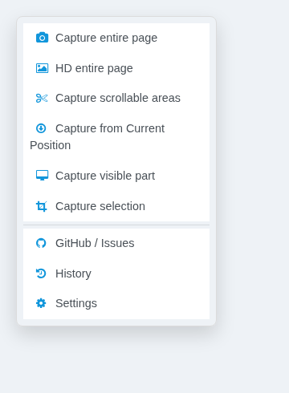
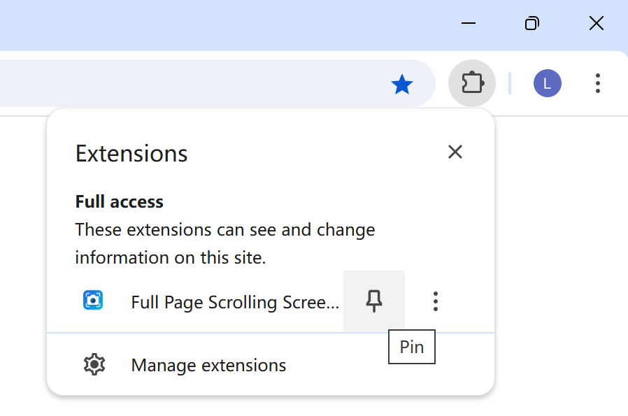
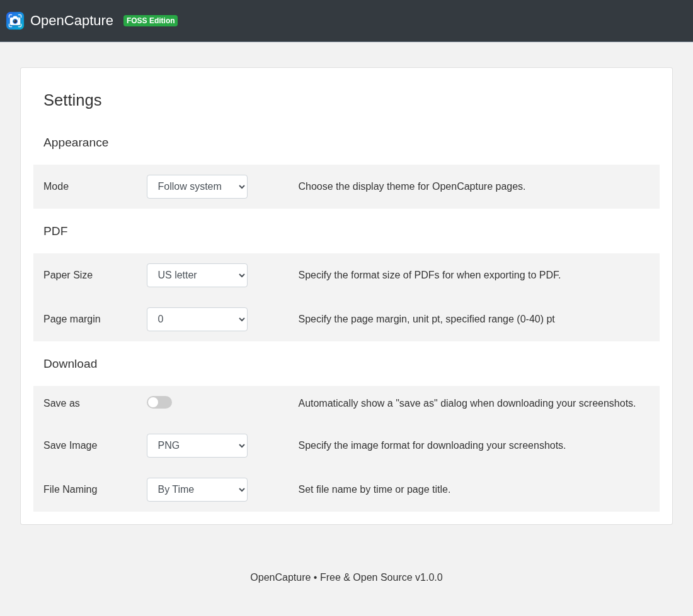

<div align="center">

# 📸 OpenCapture

**Extensão 100% Gratuita e de Código Aberto (FOSS) para Captura de Tela de Página Inteira e Anotações**  
*Zero paywalls, zero anúncios, zero rastreamento. A alternativa local-first e focada em privacidade para GoFullPage, Awesome Screenshot e FireShot.*

[](LICENSE)
[](manifest.json)
[](#-privacidade-e-seguran%C3%A7a)
[](#-privacidade-e-seguran%C3%A7a)
[](#-compatibilidade-de-navegadores)

[English](README.md) | [Português (Brasil)](README.pt-BR.md)

<br>


</div>

---

## 🚀 Por que escolher o OpenCapture?

A maioria das extensões populares de captura de tela adotou planos pagos agressivos — cobrando mensalidades para exportar PDFs com várias páginas, capturar em alta resolução ou borrar dados confidenciais, além de frequentemente coletarem métricas de navegação. Recentemente, ferramentas comerciais chegaram a ser desativadas e bloqueadas por navegadores como o Brave devido a preocupações com segurança e privacidade.

O **OpenCapture** foi criado para o caminho oposto: oferecer uma **suíte completa, rápida e segura de captura de tela** que roda 100% dentro do seu próprio navegador, sem enviar um único dado para servidores externos.

### 🌟 Principais Recursos

- ⚡ **Captura de Página Inteira e Rolagem Automática:** Captura sites inteiros ou caixas com rolagem interna (scroll) sem cortes.
- 🔍 **Captura em Alta Resolução 2x HD:** Qualidade nítida para textos e layouts em telas Retina e monitores 4K.
- ✂️ **Divisão Inteligente de Páginas Gigantes:** Divide automaticamente páginas extremamente longas em partes organizadas para exportação limpa.
- 🎨 **Editor de Anotações Completo:** Adicione setas, retângulos, textos, desenhos livres e use a **ferramenta de mosaico/desfoque (blur)** para censurar senhas e informações pessoais antes de salvar.
- 📄 **Múltiplos Formatos de Exportação:** Copie diretamente para a área de transferência, baixe em PNG/JPEG de alta qualidade ou gere **PDFs multipáginas**.
- 🗂️ **Histórico Local de Capturas:** Salva suas capturas no banco de dados local do navegador (IndexedDB) para você consultar e reeditar quando quiser.
- 🔒 **100% Local-First e Seguro:** Sem servidores na nuvem, sem login, sem telemetria e sem anúncios.

---

## 👥 Para Quem É? (Casos de Uso)

- **Designers de UX / UI:** Capture landing pages inteiras e interfaces responsivas com perfeição visual em 2x HD para portfólio ou documentação.
- **Engenheiros de QA & Testers:** Registre evidências completas de bugs de ponta a ponta, aponte inconsistências com setas e anexe diretamente no Jira, Linear ou GitHub Issues.
- **Pesquisadores, Jornalistas e Área Jurídica:** Salve páginas web inteiras em PDF multipáginas com fidelidade total e sem adulterações.
- **Desenvolvedores:** Documente telas para Pull Requests sem depender de serviços em nuvem pagos.

---

## 📊 Comparativo: OpenCapture vs Outras Ferramentas

| Recurso | OpenCapture (FOSS) | GoFullPage | Awesome Screenshot | FireShot |
| :--- | :---: | :---: | :---: | :---: |
| **Preço** | **100% Grátis** | Pago (US$ 12+/ano) | Freemium (US$ 36+/ano) | Freemium / Pro pago |
| **Exportar PDF Multi-páginas** | ✅ **Grátis e Ilimitado** | 🔒 Exige Premium | 🔒 Exige Premium | 🔒 Exige Pro |
| **Captura 2x HD (Retina)** | ✅ **Grátis** | 🔒 Exige Premium | 🔒 Exige Premium | 🔒 Exige Pro |
| **Desfoque / Mosaico (Ocultar dados)** | ✅ **Grátis** | 🔒 Exige Premium | ⚠️ Limitado | 🔒 Exige Pro |
| **Divisão de Páginas Longas** | ✅ **Automático** | 🔒 Exige Premium | ❌ Não possui | ❌ Não possui |
| **Exige Cadastro / Conta** | ❌ **Não (Zero Login)** | ⚠️ Opcional | ⚠️ Exigido em funções | ❌ Não |
| **Privacidade & Telemetria** | 🛡️ **Zero Rastreamento** | ⚠️ Analíticos | ⚠️ Rastreamento comercial | ⚠️ Analíticos |
| **Código Aberto (Open Source)** | ✅ **Licença MIT** | ❌ Fechado | ❌ Fechado | ❌ Fechado |

---

## 📦 Como Instalar (Passo a Passo para Qualquer Usuário)

Você **não precisa saber programar** nem usar comandos no terminal para instalar o OpenCapture. O processo leva menos de 2 minutos:

### 1️⃣ Baixe o OpenCapture
- **[👉 Clique aqui para baixar o OpenCapture (.ZIP)](https://github.com/nklowns/opencapture/releases/latest/download/opencapture-v1.0.0.zip)** (ou acesse a [página de Lançamentos](https://github.com/nklowns/opencapture/releases))
- Salve o arquivo em seu computador.

### 2️⃣ Extraia o Arquivo ZIP para uma Pasta Definitiva
- Clique com o botão direito no arquivo baixado e selecione **"Extrair tudo..."** (ou descompacte onde preferir).
- 💡 **Dica importante:** Coloque a pasta descompactada em um local definitivo (como em `Documentos/OpenCapture` ou uma pasta de utilitários). **Não** deixe na pasta temporária "Downloads", pois o navegador carrega a extensão diretamente dessa pasta.

### 3️⃣ Ative a Extensão no seu Navegador

#### No Google Chrome, Brave, Opera, Vivaldi ou Arc:
1. Digite `chrome://extensions` na barra de endereços (ou `brave://extensions`, `opera://extensions`) e aperte **Enter**.
2. No canto superior direito, ative a chavinha **"Modo do desenvolvedor"**.
3. No canto superior esquerdo, clique no botão **"Carregar sem compactação"** (ou *Load unpacked*).
4. Selecione a pasta descompactada do `opencapture`.

#### No Microsoft Edge:
1. Digite `edge://extensions` na barra de endereços e aperte **Enter**.
2. Na barra lateral esquerda, ative a chavinha **"Modo de desenvolvedor"**.
3. Clique em **"Carregar extensão descompactada"** e selecione a pasta do `opencapture`.

---

## 📌 Como Fixar a Extensão para Acesso Rápido

<div align="center">
  <table>
    <tr>
      <td align="center" width="45%" valign="middle">
        <strong>📸 Modos de Captura</strong><br><br>
        
      </td>
      <td align="center" width="55%" valign="middle">
        <strong>📌 Fixar na Barra de Ferramentas</strong><br><br>
        
      </td>
    </tr>
  </table>
</div>

1. Clique no **ícone de quebra-cabeça (🧩)** no canto superior direito do seu navegador.
2. Clique no **alfinete (📌)** ao lado do **OpenCapture**.
3. Pronto! O ícone de câmera estará sempre visível na sua barra para quando você precisar registrar uma página.

> 💡 **Atalho de Teclado:** Pressione `Alt + Shift + S` (ou `Cmd + Shift + S` no macOS) em qualquer página para abrir o menu do OpenCapture instantaneamente! Você pode personalizar esse atalho quando quiser em `chrome://extensions/shortcuts`.

---

## ⚙️ Opções Configuráveis

Ajuste margens de página, formatos de folha para PDF (A4, Carta, Página Única), formato padrão da imagem (PNG ou JPEG) e comportamento do download no painel de configurações:

<div align="center">
  
</div>

---

## 🔄 Como Atualizar para Versões Recentes

Quando sair uma nova versão do OpenCapture:
1. Baixe o arquivo `.zip` mais recente.
2. Substitua os arquivos da sua pasta `opencapture` pelos novos.
3. Volte em `chrome://extensions` e clique no botão de **Recarregar (🔄)** no cartão do OpenCapture. Pronto!

---

## 💻 Instalação via Terminal / Git (Opcional para Desenvolvedores)

Se você utiliza o Git:

```bash
# Clone o repositório
git clone https://github.com/nklowns/opencapture.git

# Acesse chrome://extensions ou edge://extensions
# Ative o "Modo do desenvolvedor" -> "Carregar sem compactação" -> escolha a pasta
```

---

## 🌐 Compatibilidade de Navegadores

| Navegador | Status | Nível de Suporte |
| :--- | :---: | :--- |
| **Google Chrome** | ✅ Suportado | Nativo e Permanente (Manifest V3) |
| **Microsoft Edge** | ✅ Suportado | Nativo e Permanente (Manifest V3) |
| **Brave Browser** | ✅ Suportado | Nativo e Permanente (Manifest V3) |
| **Opera / Opera GX** | ✅ Suportado | Nativo e Permanente (Manifest V3) |
| **Vivaldi** | ✅ Suportado | Nativo e Permanente (Manifest V3) |
| **Arc Browser** | ✅ Suportado | Nativo e Permanente (Manifest V3) |
| **Mozilla Firefox** | ⚠️ Aviso | Funciona temporariamente via `about:debugging`. O canal estável do Firefox restringe extensões descompactadas permanentes sem assinatura digital oficial. |

---

## 🔒 Privacidade e Segurança

O OpenCapture segue a arquitetura **100% Local-First**:
- **Zero Servidores Externos:** Toda a montagem da imagem, renderização do canvas e criação dos arquivos PDF ocorrem localmente no motor do navegador.
- **Zero Telemetria:** Não sabemos quais sites você acessa, quando usa a ferramenta ou o que você captura.
- **Zero Scripts de Terceiros:** Sem Google Analytics, sem pixels de anúncios e sem bibliotecas puxadas de servidores desconhecidos.

---

## ❓ Perguntas Frequentes (FAQ)

<details>
<summary><strong>Por que preciso ativar o "Modo de Desenvolvedor"?</strong></summary>
O Modo de Desenvolvedor é a maneira padrão e oficial dos navegadores permitirem que você instale uma extensão diretamente dos arquivos do projeto, sem depender de uma loja corporativa. Você tem controle total do código que roda no seu computador.
</details>

<details>
<summary><strong>O OpenCapture consegue capturar menus fixos sem duplicar na imagem?</strong></summary>
Sim! O motor de rolagem do OpenCapture trata elementos com posicionamento fixo (`position: fixed` e `sticky`) para evitar que cabeçalhos e barras de navegação se repitam ou sobreponham o conteúdo capturado.
</details>

<details>
<summary><strong>Consigo esconder senhas ou dados sigilosos antes de salvar?</strong></summary>
Sim! No editor que abre logo após a captura, basta usar a ferramenta de mosaico/desfoque sobre qualquer texto, número de cartão ou informação confidencial.
</details>

<details>
<summary><strong>Existe limite de tamanho de página ou quantidade de capturas?</strong></summary>
Não há limites artificiais. Tudo fica guardado no armazenamento local do seu navegador (IndexedDB), respeitando apenas o espaço livre no disco do seu computador.
</details>

---

## 📄 Licença

O OpenCapture é um software livre distribuído sob a licença [MIT](LICENSE).
As bibliotecas de terceiros utilizadas estão documentadas em [THIRD_PARTY_LICENSES.md](THIRD_PARTY_LICENSES.md).
